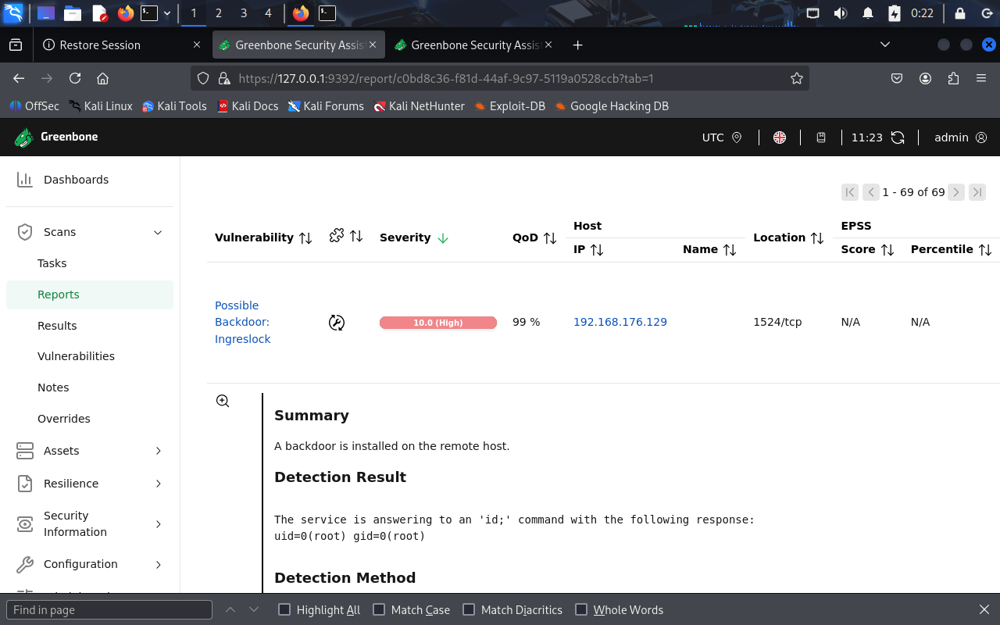
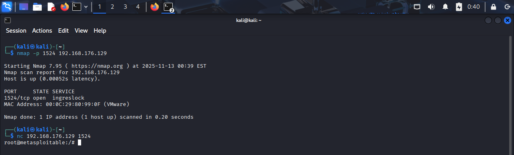
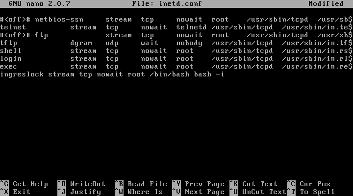

[← Back to Projects](/projects/)

# Lab: Kali (OpenVAS) → Metasploitable — Multi-vulnerability Remediation

**Author:** Tung Nguyen  
**Date:** 2025-11-05  
**Environment:** Kali attacker VM + Metasploitable target VM (host-only network)

---

## Objective
Perform discovery and vulnerability remediation on a Metasploitable VM using Greenbone/OpenVAS (GVM). Document each finding, investigation steps, remediation, verification, and artifacts so the work is reproducible and reviewable.

---

## Environment & VM configuration
- Hypervisor: VirtualBox / VMware  
- Kali VM: 6 GB RAM, 2 CPU, host-only network  
- Metasploitable VM: 1 GB RAM, 1 CPU, host-only network  
- Tools used: Greenbone/OpenVAS (GVM), nmap, ss/netstat, bash, basic Linux utilities  

---

## Workflow Summary
1. Boot Kali and Metasploitable VMs on an isolated host-only network.  
2. Confirm target IP with host discovery (`nmap`).  
3. Start GVM on Kali (`gvm-start`) and run a target scan via the GSA web UI.  
4. Review scan results; triage vulnerabilities.  
5. Inspect target VM configuration / services.  
6. Remediate each vulnerability in turn.  
7. Re-scan with OpenVAS and verify remediation.  

---

## Table of Contents
- [Vulnerability: Ingreslock Backdoor (Port 1524)](#vuln-ingreslock-backdoor-port-1524)  
- [Vulnerability: <Next vulnerability title>](#vuln-next-vuln)  
*(Add new vulnerabilities here in chronological order.)*

---

## Vulnerability Template
Use this template to add additional vulnerabilities:

### Vulnerability: <SHORT TITLE> — <SERVICE / PORT>
**Severity:** <High / Medium / Low>  
**OpenVAS ID / Reference:** <OpenVAS NVT or CVE>  

**Description (short):**  
A one-sentence summary of the issue.

**Evidence (pre-remediation):**
- GVM finding screenshot: `/images/<filename>`  
- `nmap` or port scan output:
# Example
nmap -sT -p 1-65535 <target-ip>

---

### Vulnerability: Ingreslock Backdoor (Port 1524)
**Severity:** High  
**OpenVAS ID / Reference:** NVT – *TCP Port 1524: Ingreslock Backdoor*

**Description (short):**  
The `inetd` configuration contained an entry that spawned `/bin/bash` as root when the service was contacted. This effectively functions as a backdoor, allowing anyone who can connect to that port to obtain a root shell.

**Evidence (pre-remediation):**
- OpenVAS finding screenshot: `../images/IngresLock-OpenVAS.png`  
  
- `nmap` scan showing port 1524 open (before remediation): `../images/ingreslock-scan-test.png`  
  
- Snippet of `/etc/inetd.conf` showing the malicious entry: `../images/Inetd.conf-file.png`  
  

**Root cause analysis:**  
A line in `/etc/inetd.conf` (the `inetd` super-server configuration) mapped the `ingreslock` service to `/bin/bash` and ran it as `root`. Since `inetd` launches the configured program with root privileges, any network connection to that service resulted in a root shell being spawned.

**Remediation performed:**  
1. Removed the malicious `ingreslock` line from `/etc/inetd.conf`.
2. Reboot to apply the change.
3. Scan again using nmap to make sure the port is closed and unable to netcat to it anymore.
